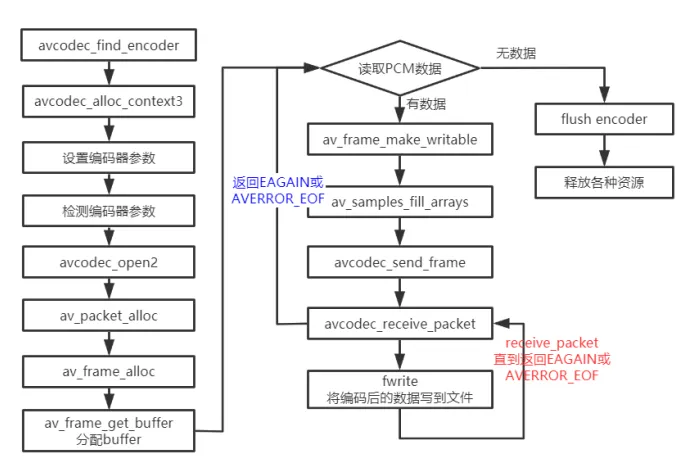

# 1. PCM --> AAC 编码
[PCM-->AAC 编码示例代码](../10_encode_audio.c)
示例代码里，使用了两种编码器，分别是 aac，libfdk_aac

`ff_aac_encoder` supported_samplerates，采用 全局 mpeg4audio_sample_rates
```c
AVCodec ff_aac_encoder = {
    .name           = "aac",
    .long_name      = NULL_IF_CONFIG_SMALL("AAC (Advanced Audio Coding)"),
    .type           = AVMEDIA_TYPE_AUDIO,
    .id             = AV_CODEC_ID_AAC,
    .priv_data_size = sizeof(AACEncContext),
    .init           = aac_encode_init,
    .encode2        = aac_encode_frame,
    .close          = aac_encode_end,
    .defaults       = aac_encode_defaults,
    .supported_samplerates = mpeg4audio_sample_rates,
    .caps_internal  = FF_CODEC_CAP_INIT_THREADSAFE,
    .capabilities   = AV_CODEC_CAP_SMALL_LAST_FRAME | AV_CODEC_CAP_DELAY,
    .sample_fmts    = (const enum AVSampleFormat[]){ AV_SAMPLE_FMT_FLTP,
                                                     AV_SAMPLE_FMT_NONE },
    .priv_class     = &aacenc_class,
};
```
`ff_libfdk_aac` channel_layouts 为 aac_channel_layout；supported_samplerates 为 aac_sample_rates；sample_fmts 也是 特别的，支持 AV_SAMPLE_FMT_S16 交错模式
```c
AVCodec ff_libfdk_aac_encoder = {
    .name                  = "libfdk_aac",
    .long_name             = NULL_IF_CONFIG_SMALL("Fraunhofer FDK AAC"),
    .type                  = AVMEDIA_TYPE_AUDIO,
    .id                    = AV_CODEC_ID_AAC,
    .priv_data_size        = sizeof(AACContext),
    .init                  = aac_encode_init,
    .encode2               = aac_encode_frame,
    .close                 = aac_encode_close,
    .capabilities          = AV_CODEC_CAP_SMALL_LAST_FRAME | AV_CODEC_CAP_DELAY,
    .sample_fmts           = (const enum AVSampleFormat[]){ AV_SAMPLE_FMT_S16,
                                                            AV_SAMPLE_FMT_NONE },
    .priv_class            = &aac_enc_class,
    .defaults              = aac_encode_defaults,
    .profiles              = profiles,
    .supported_samplerates = aac_sample_rates,
    .channel_layouts       = aac_channel_layout,
    .wrapper_name          = "libfdk",
};
```

- Packed 交错模式
- Planer 平面模式
> 缀带'P'的表示平面格式(Planar)，不带后缀的表示交错格式(Packed)
其中，AV_SAMPLE_FMT_S16 是 s16le (交错Packed)；AV_SAMPLE_FMT_FLTP 是 fltp (平面Planer)。  

示例代码里，默认传入的是 s16 / flt 交错模式
所以，AAC默认编码器只能处理 fltp 平面模式，得先把 交错转为成平面`f32le_convert_to_fltp`；而libfdk只能处理 s16le Packed模式，可以直接处理 s16 交错模式。

## 1.1. 流程：


1. `avcodec_find_encoder` 根据指定的AVCodecID查找注册的编码器。
2. `avcodec_alloc_context3` AVCodec生成一个AVCodecContext.
3. 设置 AVCodecContext 的相关编码参数
4. 检测 AVCodecContext 设置的 sample_fmts，supported_samplerates，channel_layouts。AVCodec是否支持~
5. `avcodec_open2` 绑定 AVCodec 和 AVCodecContext
6. `AVFrame` 配置音频帧参数
7. `av_frame_get_buffer` 分配buffer
8. `av_frame_make_writable` 确保帧可写。
    > FFmpeg 的 AVFrame 使用引用计数（AVBufferRef）管理数据缓冲区。当多个组件（如编码器、过滤器）引用同一帧时，直接修改数据会影响所有引用者，导致数据不一致或崩溃
9. `av_samples_fill_arrays` 根据采样格式处理数据
10. `avcodec_send_frame`    将AVFrame数据发送到编码器
11. `avcodec_receive_packet` 循环接收所有可用的编码数据包 获取到的数据存在 AVPacket
12. `补充ADTS头 + AAC编码后数据写入文件`


# 2. YUV --> H264 编码

[YUV --> H264 编码代码，代码限制了编码生成的h264画面尺寸为1280x720，所以yuv源文件要符合要求，不然就会花屏~](../11_encode_video.c)
> 测试自己的文件，需要 `ffmpeg.exe -i .\believe.flv -t 5  -r 25 -pix_fmt yuv420p  -s 1280x720 yuv420p_1280x720.yuv` 生成 1280x720 尺寸的 yuv文件
```c
AVCodec ff_libx264_encoder = {
    .name             = "libx264",
    .long_name        = NULL_IF_CONFIG_SMALL("libx264 H.264 / AVC / MPEG-4 AVC / MPEG-4 part 10"),
    .type             = AVMEDIA_TYPE_VIDEO,
    .id               = AV_CODEC_ID_H264,
    .priv_data_size   = sizeof(X264Context),
    .init             = X264_init,
    .encode2          = X264_frame,
    .close            = X264_close,
    .capabilities     = AV_CODEC_CAP_DELAY | AV_CODEC_CAP_AUTO_THREADS |
                        AV_CODEC_CAP_ENCODER_REORDERED_OPAQUE,
    .priv_class       = &x264_class,
    .defaults         = x264_defaults,
    .init_static_data = X264_init_static,
    .caps_internal    = FF_CODEC_CAP_INIT_CLEANUP,
    .wrapper_name     = "libx264",
};
```


- avcodec_find_encoder_by_name：根据指定的编码器名称查找注册的编码器 AVCodec。
- avcodec_alloc_context3：为AVCodecContext分配内存。给 AVCodecContext 设置编码参数。
- avcodec_open2：打开编解码器。AVCodecContext 和 AVCodec 进行绑定
- avcodec_send_frame：将AVFrame⾮压缩数据给编码器。
- avcodec_receive_packet：获取到编码后的AVPacket数据。
- av_frame_get_buffer: 为⾳频或视频数据分配新的buffer。在调⽤这个函数之前，必须在AVFame上设置好以下属性：format(视频为像素格式，⾳频为样本格式)、nb_samples(样本个数，针对⾳频)、channel_layout(通道类型，针对⾳频)、width/height(宽⾼，针对视频）。（和 AVCodecContext 设置的一样）
- av_frame_make_writable：确保AVFrame是可写的，尽可能避免数据的复制。如果AVFrame不是是可写的，将分配新的buffer和复制数据。
- av_image_fill_arrays: 存储⼀帧像素数据存储到 AVFrame 对应的 data buf


## 2.1. 编码器 libx264 codec_ctx
- width
- height
- time_base
- framerate
- gop_size I帧间隔，每 gop_size 帧一个关键帧
- max_b_frames B帧最大数量，每两个非B帧之间允许插入的最大连续的B帧数量
- pix_fmt 像素格式  

H264特有参数设置 priv_data，以下

- preset 预设  
预设是一系列参数的集合，这个集合能够在编码速度和压缩率之间做出一个权衡。一个编码速度稍慢的预
设会提供更高的压缩效率（压缩效率是以文件大小来衡量的)。这就是说，假如你想得到一个指定大小的文件或者采用恒定比特率编码模式，你可以采用一个较慢的预设来获得更好的质量。同样的，对于恒定质量编码模式，你可以通过选择一个较慢的预设轻松地节省比特率。
如果你很有耐心，通常的建议是使用最慢的预设。目前所有的预设按照编码速度降序排列为：
    - ultrafast
    - superfast
    - veryfast
    - faster
    - fast
    - medium - default preset
    - slow
    - slower
    - veryslow
    - placebo - ignore this as it is not useful (see FAQ)  
默认为medium级别。

    > 2 为什么placebo是一个浪费时间的玩意儿?  
    > 与veryslow相比，它以极高的编码时间为代价换取了大概1%的视频质量提升，这是一种收益递减准则，veryslow与 slower相比提升了3%;slower与 slow相比提升了5%;slow与medium相比提升了5%~10%。 

- profile 类似于编码算法吧~  所有的profile 包括：
    1. baseline profile：基本画质。支持I/P帧，只支持无交错(Progressive)和CAVLC; `实时通信`
    2. extendedprofile：进阶画质。支持I/P/B/SP/SI 帧，只支持无交错(Progressive)和CAVLC; 
    3. main profile：主流画质。提供I/P/B帧，支持无交错(Progressive)和交错(Interlaced)，也支持CAVLC 和CABAC 的支持; `流媒体`
    4. highprofile：高级画质。在mainProfile的基础上增加了8x8内部预测、自定义量化、无损视频编码和更多的YUV格式；`广电/存储`

- tune 视觉优化的参数，`视频偏好`
    - film：电影类型，对视频的质量非常严格时使用该选项
    - animation：动画片，压缩的视频是动画片时使用该选项
    - grain：颗粒物很重，该选项适用于颗粒感很重的视频
    - stillimage：静态图像，该选项主要用于静止画面比较多的视频
    - psnr：提高psnr，该选项编码出来的视频psnr比较高
    - ssim：提高ssim，该选项编码出来的视频ssim比较高
    - fastdecode：快速解码，该选项有利于快速解码
    - zerolatency：零延迟，该选项主要用于视频直播 （h264）[X264参数之zerolatency的分析](https://blog.csdn.net/DeliaPu/article/details/77004392) 

    > 如果你不确定使用哪个选项或者说你的输入与所有的tune皆不匹配，你可以忽略--tune选项。你可以使用-tune来查看tune列表，也可以通过x264--fullhelp来查看tune所采用的参数配置。  
    > 加⼊ zerolatency 之后，转码路数会明显降低。禁用帧间参考优化，每帧独立编码，避免等待前后真，但压缩率降低；提高CPU瞬时负载；​并发能力下降​：资源被少数任务独占，系统可并行处理的路数减少

- bit_rate 目标码率
- thread_count 多线程
- thread_type FF_THREAD_FRAME


# 3. H264 + AAC --> FLV 合成
[H264 + AAC --> FLV 示例代码，其中音频和视频都是自动生成的](../12_muxing_flv.c)

```c
AVOutputFormat ff_flv_muxer = {
    .name           = "flv",
    .long_name      = NULL_IF_CONFIG_SMALL("FLV (Flash Video)"),
    .mime_type      = "video/x-flv",
    .extensions     = "flv",
    .priv_data_size = sizeof(FLVContext),
    .audio_codec    = CONFIG_LIBMP3LAME ? AV_CODEC_ID_MP3 : AV_CODEC_ID_ADPCM_SWF,  // 音频编码
    .video_codec    = AV_CODEC_ID_FLV1,                                             // 视频编码
    .init           = flv_init,
    .write_header   = flv_write_header,     // 写文件头
    .write_packet   = flv_write_packet,     
    .write_trailer  = flv_write_trailer,    // 写文件尾
    .check_bitstream= flv_check_bitstream,
    .codec_tag      = (const AVCodecTag* const []) {
                          flv_video_codec_ids, flv_audio_codec_ids, 0
                      },
    .flags          = AVFMT_GLOBALHEADER | AVFMT_VARIABLE_FPS |
                      AVFMT_TS_NONSTRICT,
    .priv_class     = &flv_muxer_class,
};
```

## 总流程

## add_stream 自定义函数
```c
static void add_stream(OutputStream *ost, AVFormatContext *oc, AVCodec **codec,enum AVCodecID codec_id);
```
1. `AVCodec * codec = avcodec_find_encoder(codec_id)` 查找编码器
2. `avformat_new_stream` 这里传出的是 AVFormatContext 新建的Stream指针。  
    OutputStream 自定义结构里的 AVStream* st 和 AVFormatContext 的新 AVStream* 指向一致。
    
3. `AVCodecContext *codec_ctx = avcodec_alloc_context3(codec)`  创建编码器上下文
4. 设置编码器参数 `AVCodecContext *codec_ctx`， 判断 `AVCodec` 是否满足 参数 ~ （前面小节类似）；
    - 额外设置了AVStream 的时间基 time_base
        - 音频设置为 1/采样率 (音频需要高精度)
        - 视频设置为 1/帧率 (AVCodecContext 和 AVStream 时间基一致)

5. `AV_CODEC_FLAG_GLOBAL_HEADER` 某些格式(如MP4)需要全局头

> 主要：OutputStream保存中间指针，比如 新创建的AVStream*，给 AVStream* 赋值 id 流ID，CodecContext 编码器上下文（编码参数/上下文）

## open_audio / open_video 自定义函数

### open_audio
1. `avcodec_open2`
2. 初始化信号生成器参数
3. `alloc_audio_frame`
4. `avcodec_parameters_from_context`
5. `创建重采样上下文`

### open_video
1. `avcodec_open2`
2. `alloc_picture` 分配帧buffer
3. `avcodec_parameters_from_context` 将流参数复制到复用器，把AVCodecContext写到 AVStream 里的AVCodecContext

## avformat_write_header
`avformat_write_header` 会对 AVStream 的 time_base 修改为 音频和视频AVStream 的 time_base 会相同  
- FLV 规范要求：所有时间戳必须以`毫秒`为单位 1/1000
- ts 流，会变成 1/90k   

## write_video_frame
1. `get_video_frame` 获取视频帧 AVFrame 自定义函数
    1. av_compare_ts
    2. av_frame_make_writable
    3. sws_getContext
    4. `fill_yuv_image`   生成 yuv420p 图像
    5. sws_scale
    6. `ost->frame->pts = ost->next_pts++;` 视频pts++
2. `avcodec_encode_video2` 编码视频帧 yuv420p --> H264 (内部调用ff_libx264_encoder 的encode2回调) AVPacket
3. `write_frame` 写入编码数据包
    1. `av_packet_rescale_ts` 将 AVPacket 时间戳从编解码器时间基转换为流时间基 
        ```c
            av_packet_rescale_ts(pkt, 
                        *time_base,        // AVCodecContext.time_base
                        st->time_base      // AVStream.time_base
            );
        ```  
        > AVCodecContext（编解码器时间基） 和 AVStream（流时间基） 各有一个时间戳 time_base  
        > 流 PTS = 编解码 PTS × (流时间基 ÷ 编解码时间基)
        > 把 AVPacket 的时间戳 改成 AVStream.time_base

    2. `log_packet` 打印数据包信息
    3. `av_interleaved_write_frame` 交替写帧

> 视频帧时间戳是按照`帧`递增 / 音频帧时间戳按照`采样点`递增

## 我认为的重点是
1. add_stream
2. 时间基

