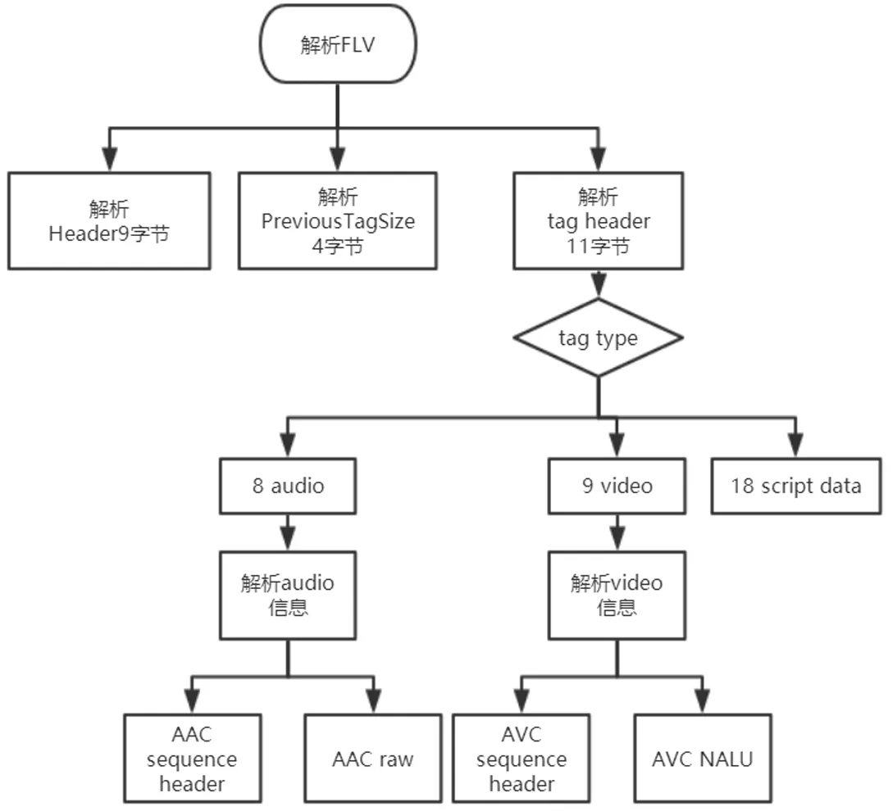
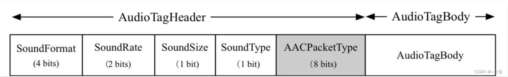
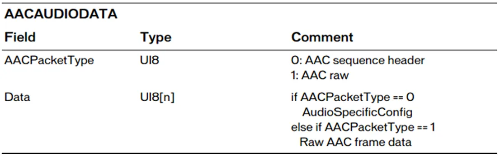
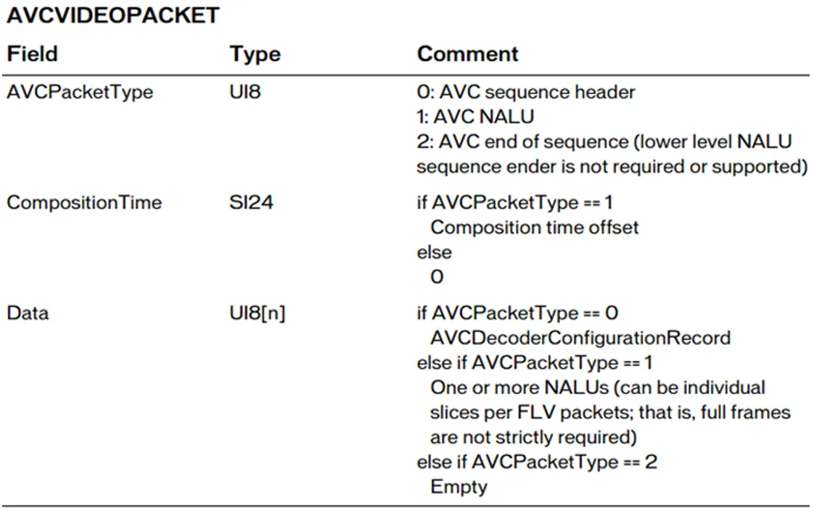

# 1. 解复用
[解复用，分析音频视频格式代码](../01_ffmpeg_demux.c)
## 1.1 流程
1. `avformat_open_input` 创建 AVFormatContext*，打开媒体文件，仅能获取基础信息（如流数据/粗略格式）(https://blog.csdn.net/leixiaohua1020/article/details/44064715)
2. `avformat_find_stream_info`，会进一步读取并分析音视频数据包填充以下详细信息：视频流（编码格式，分辨率，帧率，比特率，GOP）；音频流（编码格式，采样率，声道数，采样格式(FLTP/S16)；全局信息：文件总时长(duration)，平均码率(bit_rate) ）。`重点，此时会把数据包缓存到 AVFormatContext，后续通过av_read_frame()读出。 `(https://blog.csdn.net/leixiaohua1020/article/details/44084321)(源码挺复杂的，TODO了解)
3. `av_dump_format` 打印流参数出来
4. 遍历AVFormatContext里的streams得到每个AVStream*
5. 通过AVStream里的(`AVCodecParamters*` 专注于存储与编码数据本身相关的静态属性)codecpar->codec_type判断是否是音视频流
6. AVSteam里的AVCodecParamters结构体codecpar，可以得到
codec_type，sample_rate（采样率），format（音频格式），
channels（音频信道数量），codec_id（压缩编码格式），width，heigth（和AVCodecContext里的静态信息差不多）
6. 通过`int av_read_frame(AVFormatContext *s, AVPacket *pkt);`
获取到 AVPacket* pkt 信息 `（备注：这里的AVPacket和AVFormatContext内缓存AVPacketLists节点 共同引用计数）`
(https://blog.csdn.net/leixiaohua1020/article/details/12678577)
7. 打印出 AVPacket 里的基础信息：pts，dts，size，pos


# 2. 提取 AAC 
[解码，提取AAC](../02_extract_aac.c)

## 2.1. AAC格式
MPEG-4 标准定义的有损压缩格式
- `ADIF`。音频数据交换格式。特征：可以确定地找到这个音频数据的开始，不能进行在音频数据流中间开始的解码，即它的解码必须在明确定义的开始进行。`常用于磁盘文件中。`
- `ADTS`。AAC 音频的传输流格式。有同步字的比特流，解码可以在这个流中任意位置开始。它的特征类似于 mp3 的数据流格式。


### 2.1.1. 固定头信息 adts_fixed_header（7 字节）

- syncword：同步头，总是 0xFFF，代表一个 ADTS 帧的开始
- ID：MPEG 标识符，0 标识 MPEG-4，1 标识 MPEG-2
- Layer：always：'00'
- protection_absent：是否误码校验。0 表示 增加校验，增加 adts_variable_header；0 反之
- profile：表示使用哪个级别的 AAC。MPEG-2 / MPEG-4
    - MPEG-2
    - MPEG-4
- sampling_frequency_index：表示使用的采样率下标，通过下标在 Sampling Frequencies[] 数组中查找得到采样率的值。（4bit）
- channel_configuration：表示声道数。比如 2 表示立体声双声道

### 2.1.2 可变字段  adts_variable_header

- aac_frame_length：一个 ADTS 帧的长度包括 ADTS 头和 AAC 原始流。
> aac_frame_length = (protection_absent == 1 ? 7 : 9) + size(AACFrame)
- adts_buffer_fullness：0x7FF 说明码率可变的码流。
- number_of_raw_data_blocks_in_frame：表示 ADTS 帧中有 number_of_raw_data_blocks_in_frame + 1 个 AAC 原始帧。例如 number_of_raw_data_blocks_in_frame == 0 表示 ADTS 帧中有一个 AAC 数据块。（2bit）


## 2.2 流程
1. `avformat_open_input`
2. `avformat_find_stream_info`
3. `av_dump_format`

4. `av_find_best_stream` 
> a. 就是要获取音视频及字幕的stream_index  
> b.以前没有函数av_find_best_stream时，获取索引可以通过遍历（参考解复用代码）  
- 返回的是int值，就是返回音视频的索引值
- ic是AVFormatContext，从avformat_open_input中得来
- type是AVMediaType，是类型，在我其他文章中有提到，比如要获取视频流那么这个就是AVMEDIA_TYPE_VIDEO
- wanted_stream_nb让他自己选择填入1
- related_stream是关联流，基本不使用也填写-1
- flags填入0
```c
int av_find_best_stream(AVFormatContext *ic,
                        enum AVMediaType type,
                        int wanted_stream_nb,
                        int related_stream,
                        AVCodec **decoder_ret,
                        int flags);
```

5. 得到音频流后，查找 AVFormatContext 里的 AVStream** 。得到音频流 AVStream*，进一步可以得到 AVStream里的 `AVCodecParameters * codecpar`（和解复用差不多，通过 AVCodecParameters 获取到规格信息）

6. `av_init_packet(AVPacket*)`    初始化AVPacket
7. `av_read_frame` 从 AVFormaatContext AVPacketLists 读取缓存
8. `adts_header` 自定义函数，生成AAC格式中的adts header，一共7字节。详见代码

9. `av_packet_unref(AVPacket*)` 解引用
10. `avformat_close_input` 关闭 AVFormatContext

# 3. 提取 h264
[解码，提取h264](../03_extract_h264.c)

## 3.1. h264格式
H264除了实现对视频的压缩处理之外，为了方便网络传输，提供对应的视频编码和分片策略；类似于网络数据封装成IP帧，在H264中被称为组（GOP），片（slice），宏块（Macroblock）一起组成了H264的码流分层结构；  
重点：GOP主要用作形容一个IDR帧到下一个IDR帧之间的间隔了多少个帧。

### 3.1.1. IDR 帧
一个序列的第一个图像叫做IDR图像（立即刷新图像），IDR图像都是I帧图像。  
I 和 IDR帧都使用帧内预测。I 帧不用参考任何帧，但是之后的P，B帧可能参考这个I帧之前的帧，但是 IDR 帧不允许。   
`核心作用`：为了解码的重同步，当解码器解码到 IDR 图像时，可以讲缓存帧队列清空。当前一个序列出现错误，可以重新同步。  
> IDR 帧一定是 I 帧，I 帧不一定是 IDR 帧 ⭐

### 3.1.2. NALU

> 解码器需要一开始收到 SPS，PPS 进行初始化 ⭐    
> 发送 I 帧之前， 至少发一次 SPS 和 PPS 

H264原始码流是由多个NALU组成，分为两层：VCL（视频编码层）和 NAL（网络提取层）：（感觉不重要~）
- VCL：包括核心压缩引擎和块，宏块和片的语法级别定义，设计目标是尽可能地独立于网络进行高
效的编码;
- NAL：负责将VCL产生的比特字符串适配到各种各样的网络和多元环境中，覆盖了所有片级以上的语法级别

> VCL --> NAL（传输单元）  
> 在 VCL 进行数据传输或存储之前，这些编码的 VCL 数据，被映射或封装进 NAL 单元。  
> 一个 NALU = 一组对应于视频编码的 NALU 头部信息 + 一个原始字节序列负荷（RBSP， Raw Byte Sequence Payload）。


- 每一个 NALU ，可以通过 0x000001 或 0x00000001，用来指示一个 NALU 的起始和终止位置  
- 3 字节的 0x000001 只有一种情况：一个完整帧被编码为多个Slice时​
​首Slice​：使用4字节起始码 0x00000001，标识该帧的开始（即Access Unit的首个NALU）。​后续Slice​：使用3字节起始码 0x000001，标记同一帧内其他Slice的NALU起始位置。
> 分3字节/4字节起始码的好处：节省体积，支持随机访问（4字节起始码标记帧/关键数据的起点，使解码器可快速跳转至指定帧）

> 对于 解复用，MP4文件读取出来的packet不带startcode，但是TS文件读取出来的packet带startcode ⭐详见代码
#### 3.1.2.1. NALU header


### 3.1.3. H264封装模式
H264 两种封装
- 一种是 annexb 模式 ，传统模式，有 startcode，SPS 和 PPS 在 ES 中。一般分离h265转换为这种。
- 一种是 mp4 模式，一般 mp4 mkv 都是 mp4 模式，没有 startcode，SPS 和 PPS 以及其他信息被封装在 container 中，每一个 frame 前面 4 个字节是这个 frame 的长度   

> 很多解码器只支持 annexb 这种模式，因此需要将 mp4 做转换：在 ffmpeg 中使用 `h264_mp4toannexb_filter` 即可  
> h265_mp4toannexb_filter 可以判别格式。例如 ts 流不会处理。


## 3.3. 流程
1. avformat_alloc_context
2. avformat_open_input
3. avformat_find_stream_info
4. `videoindex = av_find_best_stream(ifmt_ctx, AVMEDIA_TYPE_VIDEO, -1, -1, NULL, 0);` 找视频流index
5. AVPacket * pkt = av_packet_alloc();  av_init_packet(pkt);
6. `const AVBitStreamFilter *bsfilter = av_bsf_get_by_name("h264_mp4toannexb");` 关键，转换mp4格式H264 为 Annex B格式。⭐
7. `AVBSFContext *bsf_ctx = NULL; av_bsf_alloc(bsfilter, &bsf_ctx);` 创建过滤器上下文。
8. `avcodec_parameters_copy(bsf_ctx->par_in, ifmt_ctx->streams[videoindex]->codecpar); av_bsf_init(bsf_ctx);` 复制视频编解码参数到过滤器，初始化过滤器。

9. av_read_frame
10. 处理细节：MP4需要经过`AVBSFContext *bsf_ctx`过滤器转换生成 startcode；ts格式已包含起始码，可直接写入。（重点⭐）


# 4. flv bit流解析
[flv bit流解析 代码](../04-flv_parser_cplus/main.cpp)
## 4.1 flv格式


> FLV body - Tag - Tag Header 的 DataSize 是 Tag Data 的部分大小  
> 音频，Timestamp 表示时间戳；视频，Timestamp 解码时间戳

解析flv流程


### 4.1.1 flv header

> UI标识无符号整形，后面的数据标识其长度是多少位。比如UI8，表示无符号整数，长度一个字节。UB表示位域，UB5表示一个字节的5位。   
> FLV头占9个字节，用来标识文件为FLV类型，以及后续存储的音视频流。一个FLV文件，每种类型的Tag都属于一个流，也就是一个flv文件最多只有一个音频流，一个视频流。不存在多个独立的音视频流在一个文件的情况。

（这里的流概念不是数据流本身，而是类似于音轨。同一类型的Tag共享同一组解码参数）

flv文件由`交替出现`的音频Tag，视频Tag和脚本Tag组成。首个Tag总是Script Tag（类型0x12），存储全局元数据（如视频时长、分辨率）；视频Tag（0x09）和音频Tag（0x08）按时间戳递增交替出现。⭐   


### 4.1.2 flv body

> FLV File body 是一连串的 back-pointers + tags 构成。Back-pointer 表示 Previous Tag Size（前一个 tag 的字节数据长度），占 4 个字节。

#### 4.1.2.1 flv tag
tag header 和 tag data

##### a. tag header


1. TimestampExtended (高 8 位) + Timestamp（低 24 位）
2. flv⽂件中Timestamp和TimestampExtended拼出来的是 `dts`。也就是解码时间。   Timestamp和TimestampExtended拼出来dts单位为ms。`（如果不存在B帧，dts等于 pts）`
3.  CompositionTime 表示PTS相对于DTS的偏移值， 在每个视频tag的第14~16字节。 显示时间(pts) = dts解码时间（tag的第5~8字节） + CompositionTime CompositionTime的单位也是ms。⭐ （`CompositionTime详见 Video Tag Data`）

备注：PTS 是显示时间戳标识解码后的视频帧应被显示的时间点，确保画面在正确的时间呈现给用户。
DTS 是解码时间戳，标识压缩数据进入解码器的时间顺序，确保帧按正确顺序解码（尤其是存在B帧时）。⭐

##### b. Script Tag Data
Script data脚本数据就是描述视频或⾳频的信息的数据，如宽度、⾼度、时间等等，⼀个文件中通常只有⼀个元数据，⾳频tag和视频tag就是⾳视频信息了，采样、声道、频率，编码等信息。  

例子：


1. 第⼀个AMF包： 第1个字节表示AMF包类型，⼀般总是0x02，表示字符串。第2-3个字节为UI16类型值， 标识字符串的⻓度，⼀般总是0x000A（“onMetaData” 字符串长度）。后⾯字节为具体的字符串，⼀般总 为 “onMetaData” （6F,6E,4D,65,74,61,44,61,74,61）。
2. 第⼆个AMF包： 第1个字节表示AMF包类型，⼀般总是0x08，表示数组。第2-5个字节为UI32类型值，表示数组元素的个数。后⾯即为各数组元素的封装，数组元素为元素名称和值组成的对。常见的数组元素如 下表所示。  
三元组结构：Type - Value_Size - Value


##### c. Audio Tag Data
音频 audio tag data 又细分为 audio tag header 和 audio tag body 数据区；  
编码格式如果不是AAC则audio tag header是1个字节，  
如果是AAC，则audio tag header是2个字节，多出来一个`AACPacketType`，用来表示audio tag body的类型；


Audio Tag Data 区域开始：
- 第一个字节包括了音频数据的参数信息
- 从第二个字节开始为音频流数据
（两个字节属于 tag 的 data 部分 ！层层划分）

第一个字节为音频的信息


从第二个字节开始为 音频数据（需要判断是真正的音频数据，还是音频 config 信息）。


##### AAC Audio Data


所以如果是 AAC 数据，如果是 AAC RAW：  
- tag data[0]：音频格式和采样率
- tag data[1]：AAC Packet Type（第二个字节开始）
- tag data[2] 才是真正的 AAC frame data

##### d. Video Tag Data
视频Tag Data开始的： 
- 第⼀个字节包含视频数据的参数信息
- 从第⼆个字节开始为视频流数据

第一个字节包含视频信息

从第二个字节开始为视频数据


##### AVC VIDEO PACKET 格式（H264别名）


- 从​整体 Tag 结构中的位置​：CompositionTime 位于 ​视频 Tag 的第 14~16 字节​（从 Tag 头的起始位置计算）。
​- Tag Data 内部的偏移​：在 Tag Data 部分（即视频数据负载），CompositionTime 的偏移是 ​第 3~5 字节​（即 [3]~[5]）。
- CompositionTime 单位毫秒：显示时间 = dts解码时间（整体tag的第5~8字节,位置索引[4]~[7]）+ CompositionTime

- AVCDecoderConfigurationRecord
描述视频流的编码参数（如分辨率、帧率、SPS/PPS等），是解码视频的必备信息

# 5. 解码libcodec AAC->PCM
[解码音频，测试格式为aac和MP3](../05-decode_audio.c)

## 流程
1. `AVCodec *codec = avcodec_find_decoder(AV_CODEC_ID_AAC);` 查找解码器，[AVCodec详见](ffmpeg_struct.md#avcodec)
2. `AVCodecParserContext *parser = av_parser_init(codec->id);` 初始化解析器[AVCodecParserContext](ffmpeg_struct.md#avcodecparsercontext)
3. `AVCodecContext *codec_ctx = avcodec_alloc_context3(codec);` 创建解码器上下文 [AVCodecContext](ffmpeg_struct.md#avcodeccontext)
4. `avcodec_open2(codec_ctx, codec, NULL);` 初始化解码器。[avcodec_open2详见](https://blog.csdn.net/leixiaohua1020/article/details/44117891)
5. `av_parser_parser2` 解析数据包。 [av_parser_parser2详见](https://blog.csdn.net/u011686167/article/details/121667755)
    ```c
    int ret = av_parser_parse2(
        parser,           // 解析器上下文（由 av_parser_init() 初始化）
        codec_ctx,        // 编解码器上下文（提供编码格式信息）
        &pkt->data,       // 输出：指向解析后帧数据的指针
        &pkt->size,       // 输出：解析后帧数据的大小
        data,             // 输入：待解析的原始数据缓冲区
        data_size,        // 输入：原始数据长度
        AV_NOPTS_VALUE,   // 输入PTS
        AV_NOPTS_VALUE,   // 输入DTS
        0                 // 输入数据在流中的位置
    );
    ```
    > 解析原始音视频压缩数据流的核心函数，其核心功能是将输入的“裸流”（无封装格式的纯编码数据，如 H.264、HEVC 等）分割成独立的帧或数据包（AVPacket），供解码器处理。
6. `decode` 自定义函数
7. `avcodec_send_packet` 将 AVPacket数据发送给解码器
    ```c
     /* 将压缩数据包发送给解码器 */
    ret = avcodec_send_packet(dec_ctx, pkt);
    if(ret == AVERROR(EAGAIN)) {
        // API使用错误：应在接收帧后重新发送
        fprintf(stderr, "Receive_frame and send_packet both returned EAGAIN, which is an API violation.\n");
    } else if (ret < 0) {
        // 提交数据包失败（非致命错误，继续处理）
        fprintf(stderr, "Error submitting the packet to the decoder, err:%s, pkt_size:%d\n",
                av_get_err(ret), pkt->size);
        return;
    }
    ```
8. `avcodec_receive_frame(dec_ctx, frame)` 从解码器接收解码后的帧
9. `av_get_bytes_per_sample` 计算每个采样的字节大小。便于将每个声道的每个采样按照个数
10. 按照 f32le 交错写入文件
    ```c
        /**
         * 平面格式(P)数据排列：LLLLLLRRRRRR（每个声道连续存储）
         * 交错格式数据排列：LRLRLRLR...（左右声道交替）
         * 注意：解码器输出可能是平面格式，这里转换为交错格式写入文件
         * 
         * 播放示例：ffplay -ar 48000 -ac 2 -f f32le output.pcm
         */
        for (i = 0; i < frame->nb_samples; i++) {
            for (ch = 0; ch < dec_ctx->channels; ch++) {
                // 将每个声道的每个采样写入文件（转换为交错格式）
                fwrite(frame->data[ch] + data_size * i, 1, data_size, outfile);
            }
        }
    ```

`重点`: 使用 av_parser_parser2 分离包数据，使用 libcodec 进行解码。

# 6. 解码libcodec H264->yuv420p
[H264->yuv420p](../06_decode_video.c)

## 流程
和上面的 AAC->PCM 类似
1. avcodec_find_decoder
2. av_parser_init     初始化解析器（用于分割裸流为NALU）
3. avcodec_alloc_context3
4. avcodec_open2
5. av_parser_parse2   使用解析器分割数据包
6. decode 自定义函数
7. avcodec_send_packet 发送压缩数据包给解码器
8. avcodec_receive_frame  循环获取所有解码完成的帧
9. yuv420p 数据写入文件
    ```c
        /**
         * 正确写入YUV420P数据的方法：
         * - Y平面：全尺寸，高度=frame->height
         * - U/V平面：1/4尺寸（宽高各减半）
         * 使用linesize处理行对齐问题（可能包含填充字节）
         */
        // 写入Y分量（亮度）
        for(int j=0; j<frame->height; j++)
            fwrite(frame->data[0] + j * frame->linesize[0], 1, frame->width, outfile);
        
        // 写入U分量（色度）
        for(int j=0; j<frame->height/2; j++)
            fwrite(frame->data[1] + j * frame->linesize[1], 1, frame->width/2, outfile);
        
        // 写入V分量（色度）
        for(int j=0; j<frame->height/2; j++)
            fwrite(frame->data[2] + j * frame->linesize[2], 1, frame->width/2, outfile);
    ```
    

# 7. FFmpeg 解码 MP4
## 7.1 MP4 格式
https://blog.csdn.net/jidushanbojueA/article/details/138411437


挺复杂的，todo后续再了解

## 7.2 解码流程
[](../07_demux_mp4.c)
和 之前的 解复用 代码差不多
- mp4 -> aac + h264
- av_find_best_stream 找到对应的流
- h264 通过 const AVBitStreamFilter *bsfilter = av_bsf_get_by_name("h264_mp4toannexb"); 转换成 annexb 模式
- aac 就是直接 添加 ADTS 头，转换成 AAC ADTS

# 8. AVIO 内存输入模式
[使用AVIO 重写 解码 aac->pcm](../08_avio_decod_aac.c)

`AVIOContext 自定义读取和写入数据操作`（这是之前音频解码的区别所在）

```c
// 自定义IO读取函数（供AVIOContext使用）
static int read_packet(void *opaque, uint8_t *buf, int buf_size)
{
    FILE *in_file = (FILE *)opaque;
    int read_size = fread(buf, 1, buf_size, in_file);
    if(read_size <=0) {
        return AVERROR_EOF;     // 文件结束标志
    }
    return read_size;
}
```
```c
    FILE *in_file = fopen(in_file_name, "rb");

    // 2. 设置自定义IO上下文（用于从文件流读取）
    uint8_t *io_buffer = av_malloc(BUF_SIZE);  // 分配IO缓冲区
    AVIOContext *avio_ctx = avio_alloc_context(
        io_buffer,    // 内部缓冲区
        BUF_SIZE,     // 缓冲区大小
        0,            // 非写模式
        (void *)in_file,  // 传递给回调函数的opaque指针
        read_packet,  // 自定义读取函数
        NULL,         // 无写函数
        NULL          // 无seek函数
    );

    // 3. 创建并配置格式上下文
    AVFormatContext *format_ctx = avformat_alloc_context();
    format_ctx->pb = avio_ctx;  // 绑定自定义IO

    // 注意：这里文件名参数为NULL，表示使用自定义IO
    ret = avformat_open_input(&format_ctx, NULL, NULL, NULL);
```
> 在`avformat_open_input`函数里，判断pb是否为空。如果不为空，则最终会通过 pb->read_packet 自定义回调函数读取数据。

# 9. 音频重采样 libswresample
通过重采样，可以对以下调整：
1. sample rate(采样率)
2. sample format(采样格式)
3. channel layout(通道布局，可以通过此参数获取声道数)

参数解析
1. sample rate 采样率   
采样设备每秒抽取样本的次数

2. sample format 采样格式及量化精度  
每种⾳频格式有不同的量化精度（位宽），位数越多，表示值就越精确，声⾳表现⾃然就越精准。
FFMpeg中⾳频格式有以下⼏种，每种格式有其占⽤的字节数信息（libavutil/samplefmt.h）
    ```c
    enum AVSampleFormat {
        AV_SAMPLE_FMT_NONE = -1,
        AV_SAMPLE_FMT_U8,          ///< unsigned 8 bits
        AV_SAMPLE_FMT_S16,         ///< signed 16 bits
        AV_SAMPLE_FMT_S32,         ///< signed 32 bits
        AV_SAMPLE_FMT_FLT,         ///< float
        AV_SAMPLE_FMT_DBL,         ///< double

        AV_SAMPLE_FMT_U8P,         ///< unsigned 8 bits, planar
        AV_SAMPLE_FMT_S16P,        ///< signed 16 bits, planar
        AV_SAMPLE_FMT_S32P,        ///< signed 32 bits, planar
        AV_SAMPLE_FMT_FLTP,        ///< float, planar
        AV_SAMPLE_FMT_DBLP,        ///< double, planar
        AV_SAMPLE_FMT_S64,         ///< signed 64 bits
        AV_SAMPLE_FMT_S64P,        ///< signed 64 bits, planar

        AV_SAMPLE_FMT_NB           ///< Number of sample formats. DO NOT USE if linking dynamically
    };
    ```

3. 分片 plane 和 打包 packed  
以双声道为例，带P(plane)的数据格式在存储时，其左声道和右声道的数据是分开存储的，左声道的数据存储在data[O]，右声道的数据存储在data[1]，每个声道的所占用的字节数为linesize[O]和linesize[1];  
不带P（packed)的音频数据在存储时，是按照LRLRLR...的格式交替存储在data[o]中，linesize[o]
表示总的数据量。

4. 声道分布  
声道分布在FFmpeg\libavutil\channel_layout.h中有定义，一般来说用的比较多的是AV_CH_LAYOUT_STEREO（双声道）和AV_CH_LAYOUT_SURROUND（三声道），这两者的定义如下：  
    ```c
    #define AV_CH_LAYOUT_STEREO
    (AV_CH_FRONT_LEFTlAV_CH_FRONT_RIGHT)
    #define AV_CH_LAYOUT_SURROUND
    (AV_CH_LAYOUT_STEREOlAV_CH_FRONT_CENTER)
    ```

5. 音频帧的数据量计算  
一帧音频的数据量(字节）= channel数 x nb_samples样本数 x 每个样本占用的字节数  

    > 如果该音频帧是FLTP格式的PCM数据，包含1024个样本，双声道，那么该音频帧包含的音频数据量是 2*1024*4=8192字节。AV_SAMPLE_FMT_DBL:2*1024*8 =16384

6. 音频播放时间计算  
以采样率44100Hz来计算，每秒44100个sample，而正常一帧为1024个sample，可知每帧播放时间/1024=1000ms/44100,得到每帧播放时间=1024*1000/44100=23.2ms(更精确的是
23.21995464852608)。  
`一帧播放时间(毫秒）=nb_samples样本数*1000/采样率`  
(1) 1024*1000/44100=23.21995464852608ms->约等于23.2ms，精度损失了
0.011995464852608ms，如果累计10万帧，误差>1199毫秒，如果有视频一起的就会有音视频同步的问题。如果按着23.2去计算pts(0 23.2 46.4）就会有累积误差。  
(2) 1024*1000/48000=21.33333333333333ms


[FFMpeg⾃带的resample例⼦：FFmpeg\doc\examples\resampling_audio.c](../09_01_audio_resample.c)

[封装 音频重采样，使用 AVAudioFifo 优化](../09_02_audio_resample/main.c)
> AVAudioFifo 作为缓冲区  
> 允许：1. 累积多次重采样结果 → 合并成完整输出帧;   2.拆分大型重采样结果 → 分批输出

缓冲速率不匹配问题：  
输入：48000Hz，每次 1024 个样本  
输出：44100Hz，期望每次 1152 个样本  
重采样转换率：48000 → 44100 ≈ 1.088:1  
关键问题：每次重采样输出的样本数不固定且不等于 1152  

## 流程
#### 1. **初始化阶段**
| 顺序 | 函数                          | 作用                                                                 |
|------|-------------------------------|----------------------------------------------------------------------|
| 1    | `swr_alloc()`                 | 分配重采样上下文（SwrContext）                                      |
| 2    | `av_opt_set_int()`            | 设置输入参数：通道布局/采样率<br>设置输出参数：通道布局/采样率       |
| 3    | `av_opt_set_sample_fmt()`     | 设置输入/输出的音频样本格式                                         |
| 4    | `swr_init()`                  | 初始化重采样上下文                                                  |

#### 2. **内存分配阶段**
| 顺序 | 函数                                | 作用                                                                 |
|------|-------------------------------------|----------------------------------------------------------------------|
| 5    | `av_get_channel_layout_nb_channels()` | 获取输入/输出的通道数量                                             |
| 6    | `av_samples_alloc_array_and_samples()` | 为输入样本分配内存空间                                              |
| 7    | `av_rescale_rnd()`                  | 计算初始输出样本数量（考虑采样率转换）                              |
| 8    | `av_samples_alloc_array_and_samples()` | 为输出样本分配内存空间                                              |

#### 3. **重采样处理阶段**
| 顺序 | 函数                          | 作用                                                                 |
|------|-------------------------------|----------------------------------------------------------------------|
| 9    | `fill_samples()`              | 生成输入音频数据（如正弦波）                                        |
| 10   | `swr_get_delay()`             | 获取重采样器当前延迟（样本数）                                      |
| 11   | `av_rescale_rnd()`            | 动态计算输出样本数量（含延迟补偿）                                  |
| 12   | `av_samples_alloc()`          | 必要时扩展输出缓冲区                                                |
| 13   | `swr_convert()`               | **核心操作**：执行音频重采样转换                                    |
| 14   | `av_samples_get_buffer_size()` | 计算输出数据的实际大小                                              |
| 15   | `fwrite()`                    | 写入重采样后的数据到文件                                            |
| (循环执行步骤 9-15 直到数据处理完成) | | |

#### 4. **收尾阶段**
| 顺序 | 函数                          | 作用                                                                 |
|------|-------------------------------|----------------------------------------------------------------------|
| 16   | `swr_convert()`               | 传入`NULL`刷新重采样器，获取剩余样本                                |
| 17   | `av_samples_get_buffer_size()` | 计算剩余输出数据的大小                                              |
| 18   | `fwrite()`                    | 写入剩余数据到文件                                                  |
| 19   | `swr_free()`                  | 释放重采样上下文                                                    |
| 20   | `av_freep()`                  | 释放输入/输出样本缓冲区                                             |

### 关键函数说明
1. **`swr_convert()`**  
   - **核心功能**：执行实际的重采样计算
   - **输入**：原始音频数据 + 样本数
   - **输出**：重采样后的数据 + 实际输出样本数
   - **刷新操作**：传入 `(NULL, 0)` 获取延迟样本

2. **动态缓冲区管理**  
   ```c
   // 计算输出样本数（含延迟补偿）
   dst_nb_samples = av_rescale_rnd(
       swr_get_delay(swr_ctx, src_rate) + src_nb_samples,
       dst_rate, src_rate, AV_ROUND_UP
   );
   ```
   当输出缓冲区不足时需重新分配内存。

### 完整流程示意图


> 总结：音频重采样的核心是 **参数设置 → 内存管理 → 循环转换 → 刷新延迟** 四步流程，通过 `swr_convert()` 实现采样率/格式/通道布局的转换，需特别注意动态计算输出样本数量和管理缓冲区大小。


